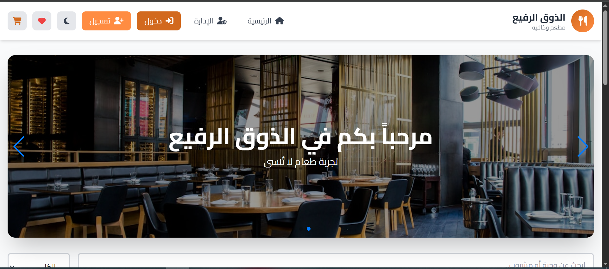
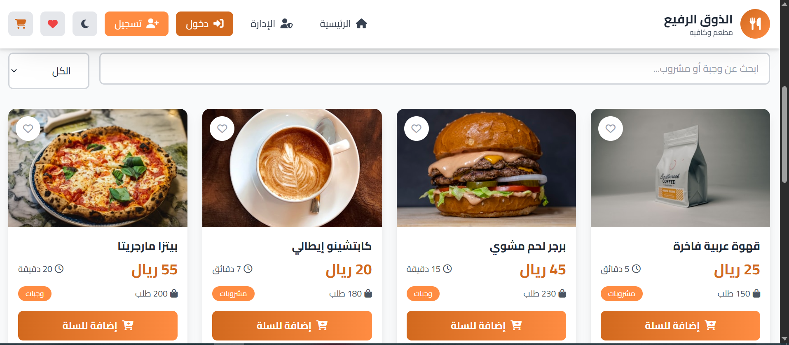
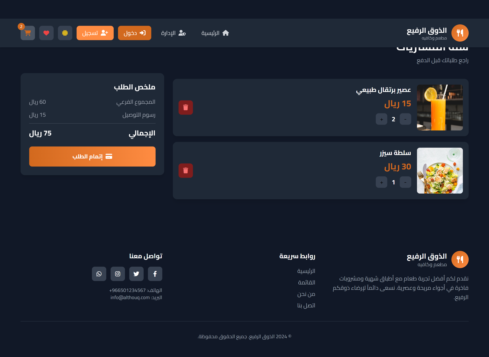
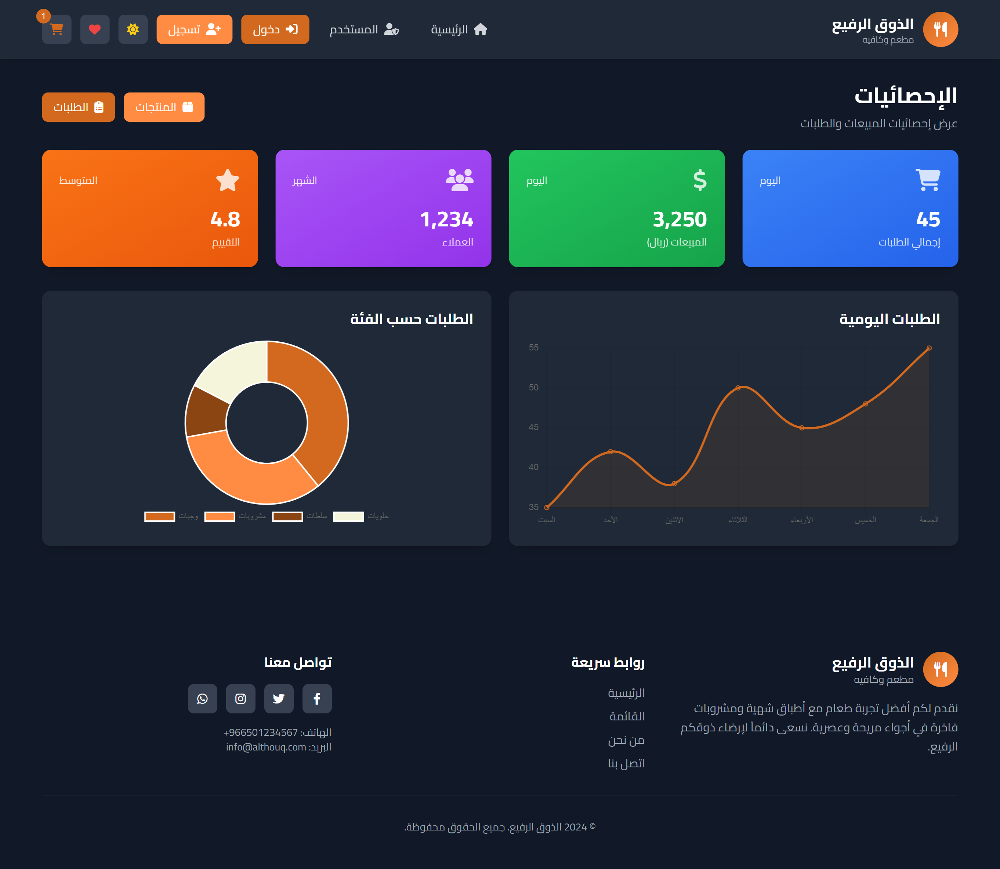
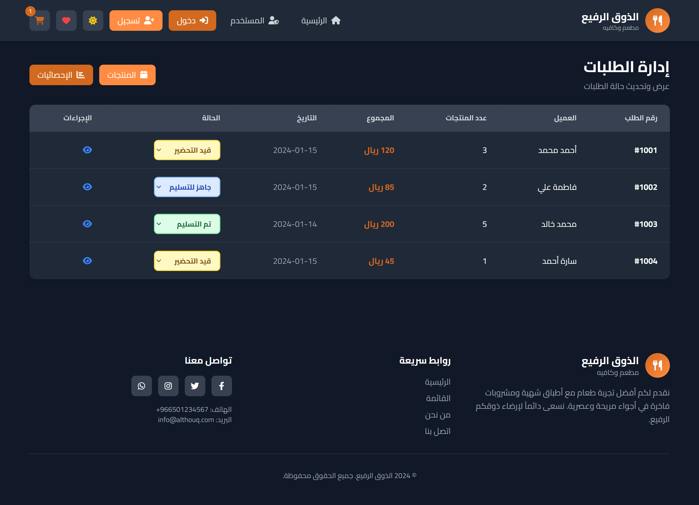
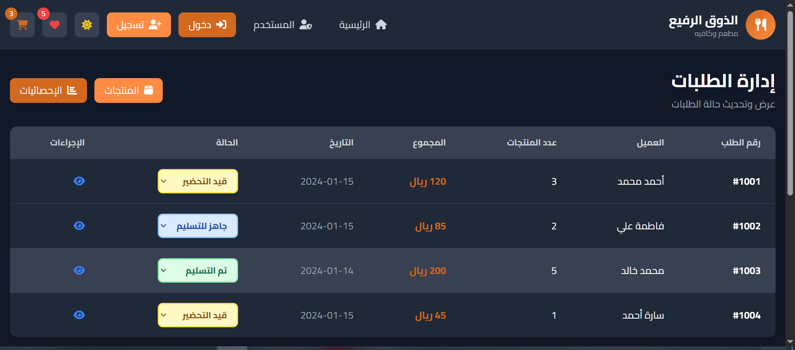
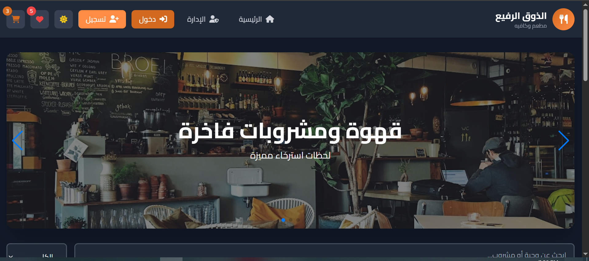
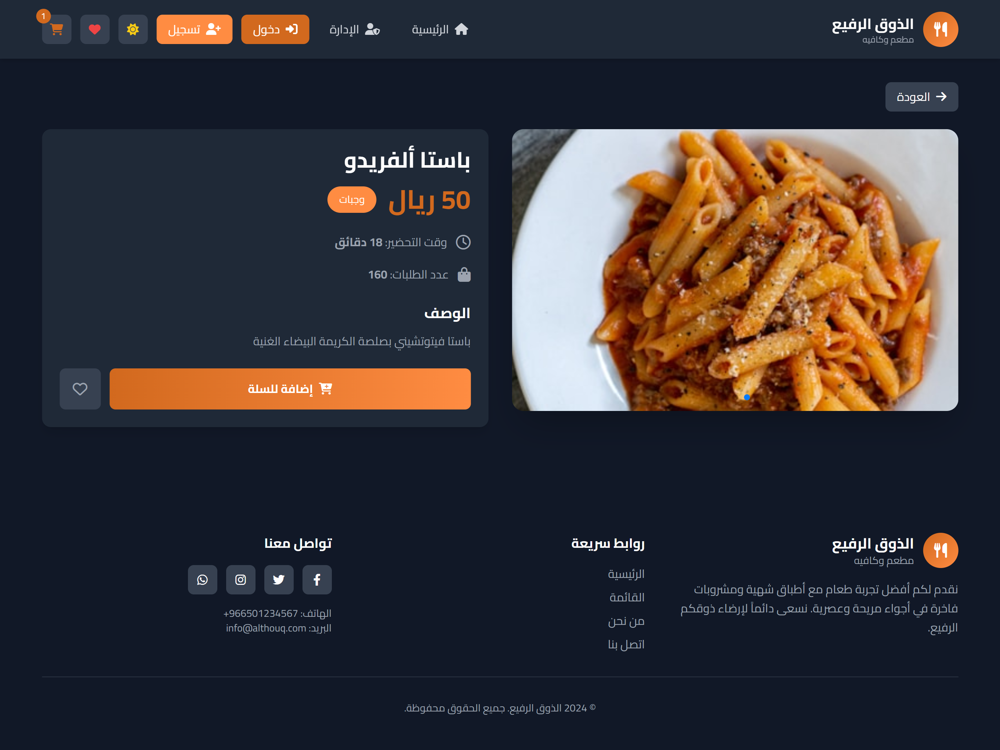
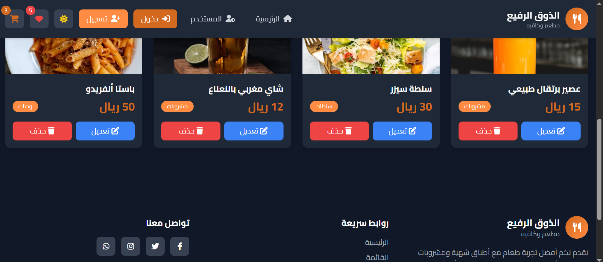

# 🍽️ Al-Thawq Al-Rafea - Restaurant & Café Management System

> A modern, responsive restaurant and café management application built with **HTML5**, **CSS3**, **JavaScript**, and **Alpine.js**

---

## 📋 Table of Contents

1. [Project Overview](#project-overview)
2. [Features](#features)
3. [Project Structure](#project-structure)
4. [Technology Stack](#technology-stack)
5. [Installation & Setup](#installation--setup)
6. [Live Demo](#live-demo)
7. [Gallery](#gallery)
8. [Video Demo](#video-demo)
9. [Portfolio](#portfolio)
10. [File Structure](#file-structure)

---

## 🎯 Project Overview

**Al-Thawq Al-Rafea** (The Refined Taste) is a full-featured restaurant management system that provides both customer-facing functionality and administrative controls. The application is built with a modern, responsive design that works seamlessly across all devices with support for **Dark Mode**.

### Key Highlights:
- ✅ Fully responsive design (Mobile, Tablet, Desktop)
- ✅ Dark mode support with persistent state
- ✅ Real-time cart and wishlist management
- ✅ Admin panel for product and order management
- ✅ Interactive product carousel
- ✅ Search and category filtering
- ✅ Order tracking system
- ✅ Beautiful UI with Tailwind CSS

---

## ✨ Features

### Customer Features:
- **Browse Products**: View all available food and beverage items
- **Product Details**: Detailed descriptions with pricing and preparation time
- **Shopping Cart**: Add/remove items, adjust quantities, view total price
- **Wishlist**: Save favorite items for later
- **Search & Filter**: Search by name, filter by category
- **Order History**: Track previous orders and their status
- **Responsive Design**: Perfect display on all screen sizes
- **Dark Mode**: Eye-friendly dark theme toggle

### Admin Features:
- **Product Management**: Create, edit, and delete menu items
- **Order Management**: Monitor and update order status
- **Analytics Dashboard**: View order statistics and customer data
- **Inventory Control**: Track product availability
- **Performance Metrics**: Monitor popular items and sales trends

---

## 🏗️ Project Structure

```
Resturant/
│
├── index.html                 # Main HTML file with complete UI structure
├── script.js                  # JavaScript logic and Alpine.js data management
├── styles.css                 # Custom CSS styles
├── r1.jpg, r2.jpg, ... r9.jpg # Restaurant gallery images
├── Resturant.mp4              # Video demonstration
└── README.md                  # This file
```

### Detailed Component Breakdown:

#### **index.html** (639 lines)
The main markup file containing:
- **Header Section**: Navigation bar with logo, menu buttons, user authentication links
- **Dark Mode Toggle**: Switch between light and dark themes
- **Cart & Wishlist Icons**: Real-time badge counters
- **Hero Section**: Carousel slider with Swiper.js
- **Products Grid**: Responsive layout displaying all menu items
- **Product Card**: Individual item display with image, name, price, description
- **Admin Dashboard**: Dedicated interface for administrators
- **Shopping Cart**: Full cart management interface
- **Wishlist View**: Saved favorites display
- **Order Management**: Admin order tracking and status updates
- **Footer**: Additional navigation and information

#### **script.js** (143 lines)
The application logic containing:
- **Alpine.js Data Factory**: Central state management using `appData()` function
- **State Variables**:
  - `darkMode`: Boolean for theme toggling
  - `currentPage`: Track active view (home, admin, cart, wishlist, etc.)
  - `isAdmin`: Admin mode toggle
  - `cart[]`: Shopping cart items
  - `wishlist[]`: Saved favorite items
  - `products[]`: Complete product database with 8 sample items
  - `orders[]`: Order history with status tracking
- **Core Methods**:
  - `toggleDarkMode()`: Switch between light/dark theme
  - `addToCart()`: Add items to cart with quantity management
  - `removeFromCart()`: Delete items from cart
  - `updateQuantity()`: Modify item quantities
  - `toggleWishlist()`: Add/remove from favorites
  - `isInWishlist()`: Check wishlist status
  - `filteredProducts`: Computed property for search/filter results
  - `cartTotal`: Calculate total cart value
  - `categories`: Extract all product categories
  - `deleteProduct()`: Admin function to remove menu items
  - `updateOrderStatus()`: Update order delivery status
- **Swiper.js Integration**: Automatic carousel with 3-second interval
- **Event Listeners**: DOM ready handlers for carousel initialization

#### **styles.css** (21 lines)
Custom styling:
- **Font Configuration**: Cairo font family for Arabic text
- **Swiper Styles**: Custom carousel styling
- **Image Optimization**: Full-width responsive images with object-fit cover

---

## 💻 Technology Stack

| Technology | Purpose |
|------------|---------|
| **HTML5** | Semantic markup and structure |
| **CSS3** | Styling and responsive design |
| **JavaScript (ES6+)** | Dynamic functionality and interactivity |
| **Alpine.js** | Lightweight reactive framework for state management |
| **Tailwind CSS** | Utility-first CSS framework for rapid UI development |
| **Swiper.js** | Touch-enabled carousel/slider functionality |
| **Font Awesome 6.4.0** | Icon library for UI elements |
| **Chart.js** | Data visualization for analytics |
| **Google Fonts (Cairo)** | Arabic typography support |

---

## 🚀 Installation & Setup

### Prerequisites:
- No backend server required (client-side only)
- Modern web browser with JavaScript enabled

### Steps:

1. **Clone or Download Project**
   ```bash
   # Download the project files to your local machine
   ```

2. **Place Files in Web Directory**
   ```
   Ensure all files (index.html, script.js, styles.css) 
   are in the same directory
   ```

3. **Launch in Browser**
   - Option 1: Double-click `index.html`
   - Option 2: Use a local server:
     ```bash
     # Using Python 3
     python -m http.server 8000
     
     # Using Node.js http-server
     npx http-server
     ```

4. **Access the Application**
   ```
   Open browser and navigate to: http://localhost:8000
   ```

---

## 🌐 Live Demo

Experience the full application online:

### **Live Demo Link**
👉 [https://resturant-cafe-app.vercel.app/](https://resturant-cafe-app.vercel.app/)

Visit the live demo to:
- Browse all menu items in real-time
- Test the shopping cart and wishlist features
- Try the dark mode toggle
- Explore the admin panel functionality
- Test filtering and search capabilities

---

## 📸 Gallery

The restaurant features a beautiful image gallery showcasing the venue and food:

### معرض الصور (r1 إلى r9)

عرض سريع للصور الموجودة في المشروع. ضع ملفات الصور التالية في نفس مجلد المشروع (مع `README.md` و `index.html`):


### Screenshot 1: Main Interface










---

## 🎬 Video Demo

### Project Demonstration Video

📹 **Video File**: `Resturant.mp4`

This video provides a comprehensive walkthrough of the entire application including:
- **Feature Overview**: All key functionalities demonstrated
- **User Interface Navigation**: How to navigate through different sections
- **Shopping Experience**: Adding items to cart and checkout process
- **Admin Panel**: Managing products and orders
- **Dark Mode**: Theme switching demonstration
- **Responsive Design**: Mobile and tablet view showcase
- **Performance**: Application speed and responsiveness

**File Location**: Stored in the project root directory alongside `index.html`

### 📥 Download Video
👉 **[Download Resturant.mp4](Resturant.mp4)** - Full project demonstration

The video is also available on the developer's portfolio website for easy viewing and sharing.

---

## 🎓 Portfolio

This project is showcased in the developer's professional portfolio:

### **Developer Portfolio**
👉 [https://mohamed-abdelmajeed-portfolio.vercel.app/](https://mohamed-abdelmajeed-portfolio.vercel.app/)

### Project Presence:
✅ The **Restaurant Management System** is featured in the portfolio as a showcase project
✅ Complete project documentation and video demo are available in the portfolio
✅ View the source code, technologies used, and project impact
✅ Download project files and resources directly from the portfolio

---

## 📦 File Structure Explained

### Root Directory Contents:
```
Resturant/
│
├── 📄 index.html
│   └─ Complete HTML5 markup with embedded meta tags
│      Structure: Header → Hero → Products → Admin → Cart → Footer
│
├── 📄 script.js
│   └─ Alpine.js application logic
│      - State management
│      - Event handlers
│      - Computed properties
│      - Helper functions
│
├── 📄 styles.css
│   └─ Custom CSS rules
│      - Font configuration
│      - Component-specific styling
│      - Responsive adjustments
│
├── 🖼️ r1.jpg through r9.jpg
│   └─ Restaurant gallery images
│      9 high-quality photos of restaurant/cafe
│      Ready for carousel or gallery integration
│
├── 🎬 Resturant.mp4
│   └─ Video demonstration
│      Complete feature walkthrough
│      Available on portfolio website
│
└── 📖 README.md
    └─ This documentation file
```

---

## 🎨 Customization Guide

### Colors & Branding:
Edit Tailwind configuration in `index.html`:
```javascript
theme: {
    extend: {
        colors: {
            primary: '#D2691E',      // Chocolate brown
            secondary: '#FF8C42',    // Dark orange
            light: '#F5F5DC',        // Beige
            dark: '#8B4513'          // Dark brown
        }
    }
}
```

### Adding New Products:
Edit the `products` array in `script.js`:
```javascript
{ 
    id: 9, 
    name: 'New Item', 
    price: 50, 
    time: '15 دقيقة', 
    orders: 0, 
    category: 'وجبات', 
    image: 'image-url',
    description: 'Item description'
}
```

### Language:
The interface supports **RTL (Right-to-Left)** Arabic text:
```html
<html lang="ar" dir="rtl">
```

To switch to English, change to:
```html
<html lang="en" dir="ltr">
```

---

## 📱 Browser Compatibility

| Browser | Support |
|---------|---------|
| Chrome | ✅ Full Support |
| Firefox | ✅ Full Support |
| Safari | ✅ Full Support |
| Edge | ✅ Full Support |
| Opera | ✅ Full Support |
| Mobile Browsers | ✅ Fully Responsive |

---

## ⚙️ API & Data Management

The application uses **client-side state management** with Alpine.js:
- All data is stored in browser memory
- Shopping cart and wishlist persist during the session
- Admin changes are temporary (reset on page refresh)
- No backend server required

For production use, consider:
1. Adding a backend API (Node.js, Python, etc.)
2. Implementing a database (MongoDB, PostgreSQL, etc.)
3. Adding user authentication
4. Implementing payment gateway

---

## 🔒 Security Notes

Current implementation is for demonstration purposes. For production:
- ✅ Validate all user inputs
- ✅ Implement proper authentication
- ✅ Use HTTPS for all connections
- ✅ Protect sensitive data
- ✅ Add CORS headers
- ✅ Implement rate limiting

---

## 📞 Support & Feedback

For questions or feedback:
- 📧 Check the portfolio website for contact information
- 💼 Visit: [https://mohamed-abdelmajeed-portfolio.vercel.app/](https://mohamed-abdelmajeed-portfolio.vercel.app/)

---

## 📄 License

This project is part of a portfolio demonstration.

---

## 🙏 Acknowledgments

Built with:
- **Tailwind CSS** for rapid UI development
- **Alpine.js** for reactive components
- **Swiper.js** for carousel functionality
- **Font Awesome** for icon assets
- **Unsplash** for placeholder images

---

## 📊 Project Statistics

- **Total Lines of Code**: 803
- **HTML Lines**: 639
- **JavaScript Lines**: 143
- **CSS Lines**: 21
- **Number of Products**: 8 (expandable)
- **Number of Sample Orders**: 4
- **Gallery Images**: 9
- **Responsive Breakpoints**: Mobile, Tablet, Desktop

---

## 🎯 Future Enhancements

Potential features for future versions:
- [ ] User registration and login system
- [ ] Payment gateway integration (Stripe, PayPal)
- [ ] Order notifications (Email/SMS)
- [ ] Real-time order tracking
- [ ] Customer review system
- [ ] Advanced analytics dashboard
- [ ] Multi-language support
- [ ] API backend integration
- [ ] Mobile app version
- [ ] AI-powered recommendations

---

**Last Updated**: January 2026

**Version**: 1.0.0

**Status**: ✅ Production Ready
